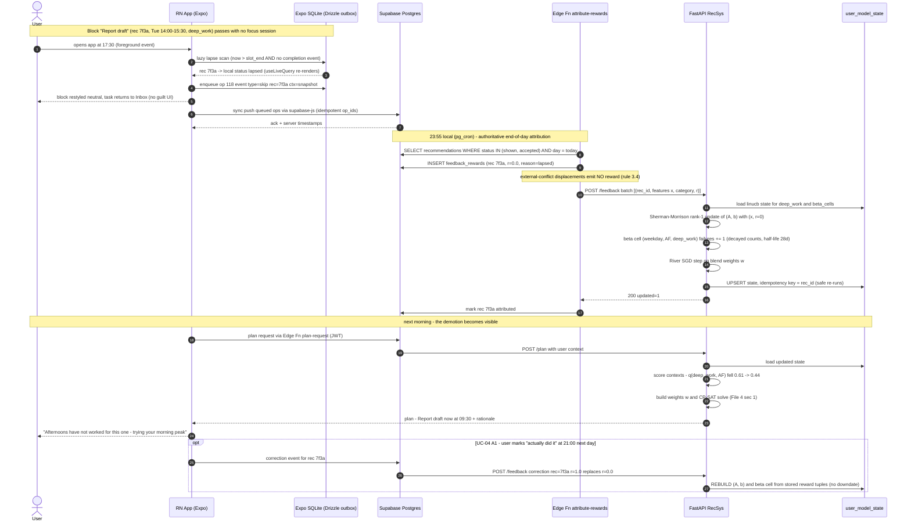
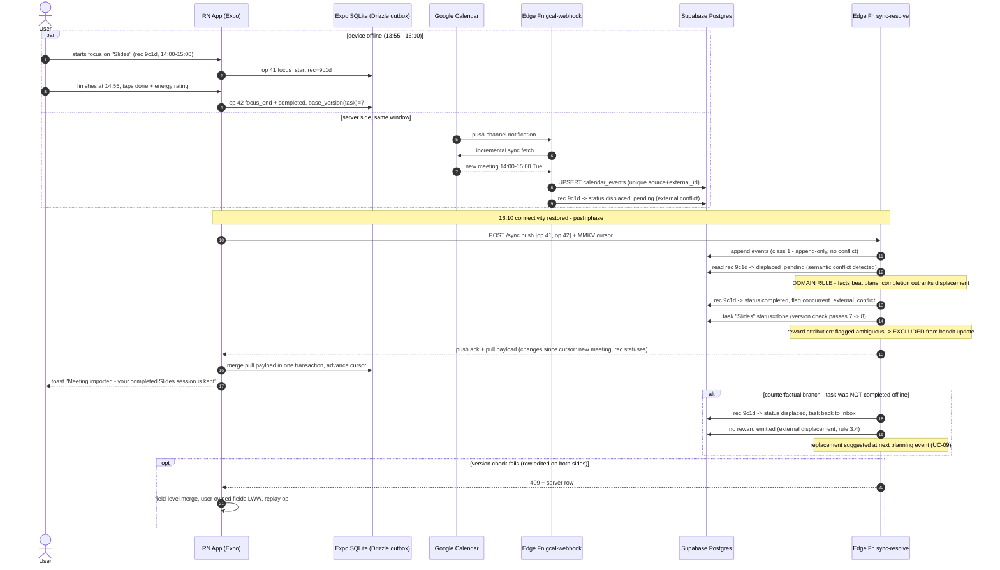

# 05 — Sequence Diagrams (React Native Revision)

> **Project:** Kairos — Personal Time Optimization via Recommendation Systems
> **Document:** Mermaid.js sequence diagrams for the two highest-complexity interactions
> **Status:** v1.1-RN — supersedes `05_sequence_diagrams.md` v1.0. **Change scope: participant naming only** (React Native/Expo client, Expo SQLite + Drizzle outbox replace Flutter/Drift). The logic, sync protocol, domain rules, and reward semantics are byte-for-byte identical to v1.0.

---

## 1. UC-04 — The Forgiveness Loop (missed block → model update → demoted score)

**Normative design decisions (unchanged):** lapse detection is **lazy** — computed on next app foreground and, authoritatively, by the end-of-day attribution job; no correctness depends on background execution (this constraint was OS-driven, not framework-driven — `expo-task-manager` background scheduling is exactly as unreliable on iOS as Dart isolates were, so the design carries over untouched). Feedback is **two-phase**: instant signals update the bandit immediately via `/feedback`; lapses are finalized once per local day; late corrections trigger a per-user state **rebuild** from stored reward tuples, never a rank-one downdate.

## 2. Offline-First Sync & Semantic Conflict Resolution

**Protocol summary (unchanged).** The Drizzle-managed outbox in Expo SQLite keeps an ordered log of operations, each with a client-monotonic `op_id` and the `base_version` of any mutated row; the sync cursor lives in MMKV. Sync is **push-then-pull against a server cursor**. Three conflict classes: (1) `events` are append-only — never conflict; (2) plain state rows use optimistic version checks with last-write-wins on user-owned settings; (3) **semantic** conflicts (plan vs. reality) are resolved by domain rules in the `sync-resolve` Edge Function — governing rule: **facts beat plans**. Rewards whose context became ambiguous are flagged and **excluded** from bandit updates (File 3 §3.4), never guessed.

## 3. Diagram-to-Spec Traceability

| Diagram element | Spec anchor |
|---|---|
| Lazy lapse scan on foreground (no background timers) | UC-04 (File 2); OS constraint holds identically for Expo — normative |
| End-of-day attribution job as authority | File 3 §3.4 attribution window; NFR-O1 |
| Two-phase feedback + rebuild-on-correction | File 3 §3.5 as amended by Phase 4 audit |
| Sherman–Morrison update, decayed Beta counts | File 3 §3.2 Stage 2/4; File 4 §1.4 |
| Facts-beat-plans rule; ambiguous-reward exclusion | File 3 §3.4; UC-09 (File 2) |
| Push-then-pull, op_id idempotency, version checks | NFR-R1 (File 2); outbox = Drizzle tables, cursor = MMKV (File 3 v1.1-RN §2.1) |
| Reactive UI updates after local writes | Drizzle `useLiveQuery` (replaces Drift streams 1:1) |
| displaced_pending / concurrent flag | Schema migration M-02 (unchanged) |
